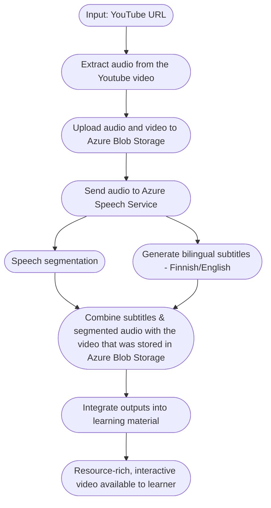

```mermaid
flowchart TD
    A([Input: YouTube URL])
    B([Extract audio from the Youtube video])
    C([Upload audio and video to Azure Blob Storage])
    D([Send audio to Azure Speech Service])
    E([Speech segmentation])
    F([Generate bilingual subtitles - Finnish/English])
    G([Combine subtitles & segmented audio with the video that was stored in Azure Blob Storage])
    H([Integrate outputs into learning material])
    I([Resource-rich, interactive video available to learner])

    A --> B
    B --> C
    C --> D
    D --> E
    D --> F
    E --> G
    F --> G
    G --> H
    H --> I
```